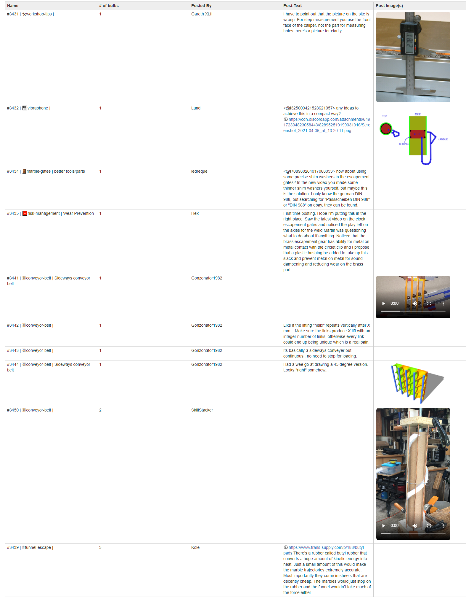
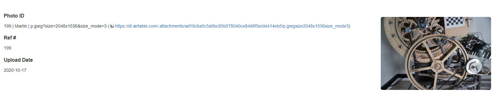
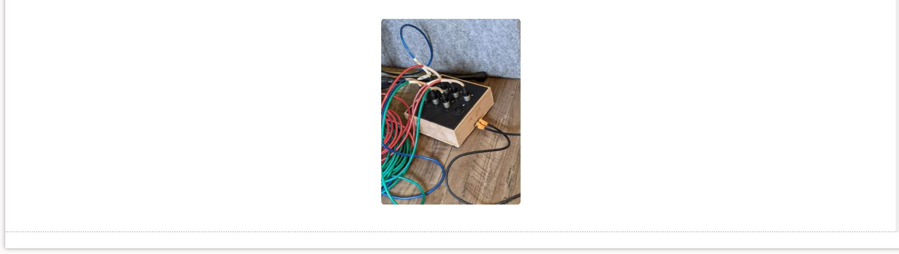

# Airtable Dokuwiki Sync

A Dokuwiki plugin to sync data from airtable

## Prerequisites:

* Create an airtable account and get an API key: https://airtable.com/api - also see their documentation on how to
  create a query
* Make sure your account is **READ ONLY**

## Installation

* Place the airtable folder inside your Dokuwiki plugin directory:
  DOKUWIKI_ROOT/lib/plugins
* Set your **Base ID** and **API Key** using Dokuwiki's [configuration Manager](https://www.dokuwiki.org/plugin:config)
* set **Max Records** parameter - this will add a limit to the number of rows in a table that a user can generate

## Usage:

Use the following syntax on any dokuwiki page.
`{{airtable>display: "theType" | record-url: "theRecordURL" | fields: "field1"@type[typeOptions], "field2"@type2}}`

Each parameter: is followed by a space and values enclosed in "". Parameters are separated by ' | ' (note the importance
of spaces here)  
Multiple fields are separated by `,`

Required Parameters:

* `type: ` - This sets the display mode. Values:
    * `image`
    * `record`
    * `table`
    * `text`
* `record-url: ` - The table/record you wish to pull data from.
    * Within airtable, expand any record (by clicking on a field and pressing space) and copy the URL in the address
      bar.
    * For a table URL, simply select the required table and copy the URL from the address bar
    * E.g. https://airtable.com/tblQeRuyF7dZuuOLr/viwY9EwnBsF9dWsPt?blocks=hide
* `fields:` - This specifies the fields you want to pull data from
    * Copy the name exactly as shown in the table (not from inspecting a record)
    * The main format is: `"Field Name"@Type[type_option]` Explained below:

## Fields:

See examples of usage at the end of this readme  
In order to process some fields correctly, you may have to specify the field type.  
By default, the type is set to `string`. You can specify a field type by using the `@` symbol after the field name.  
`"Some column name"@multi_select`

You can give arguments to a field with `[options]` after the field:  
`"Fusion Link"@url[Link Label Goes Here]`

Below are the valid types with explanations:

* `string` (default) - This is how most fields will be rendered for types such as, long text, short text, single select,
  anything that requires no additional processing can be rendered as a string. URLs will also work with the string type
  but if you want to specify a label for the string, use the @url field type
* `attachment` - This is used to render any attachment types (mostly images) *note that you don't have to specify the
  field type attachment if your display type is image* Options:
    * `Image Index` - Similar to array indexing in Python, if there are multiple images, and you only require one enter
      the index position of the single image, write: `[1]` to get the second image in airtable. To get a range of
      attachments you can write `[1:4]`. To get the last attachment: `[-1]`
* `checkbox` Renders a checkbox. Options `[checkbox_symbol, colour, font-size]`:
    * `checkbox_symbol` - enter one of the following symbols for a ticked checkbox:
        * `tick`
        * `star`
        * `heart`
        * `thumb`
        * `flag`
        * `checkbox_checked`
    * `colour` enter the hex colour for the unchecked and checked box
    * `font-size` enter the size of the font (with units)
    * E.g: `"fiedName@checkbox[thumb, #E52E4D, 24px]` - note that to specify the font-size, you need to enter the
      unicode and colour reference. The same goes for the colour option
* `rating` - Renders multiple symbols (default are stars) to display the rating. Use the same symbol options
  as `checkbox`. E.g. `"field"@rating[thumb]` will render 3 thumbs if the rating was 3
* `multi_select` - Renders items in a multi-select field *note that single select fields can just be rendered as a
  String*
* `url` - If you want to change the label of a URL then set this as the field type, otherwise just leave as type: String
    * `url_label` E.g. `"fieldName"@url[A Link]` would turn any link found for the fieldName into A Link rather
      than www.google.com etc. In tables this will apply the same label to all links
    * Note that if you wanted to set individual link labels you can edit the URL within airtable and add the
      parameter: `?dw-label=Some+Individual+Label` to the end of the URL (make sure it us URL encoded)
* `linked_record` *ALPHA: Looking for feedback on this implementation* - This is used to link to a record from another
  table. Options:
    * `tableID` - enter the table ID that the field links to. You can find this out by expanding the record, clicking on
      the link record and airtable will draw a connection with the table it links to. Open the linking table and copy
      the table ID from the url. It starts with: `tbl` e.g: `tblti8cl94I8QBcyK`
    * `linked_field_name` - enter the name of the column (surrounded by '') that should represent the linked record.
      This plugin allows you to fetch one (String) field for every linked record.
    * The plugin will then create a clickable link that links to the linked record in airtable.
    * Example: `"FieldName"@linked_record[tblti8cl94I8QBcyK, 'Part Name']`

You can find the field type by hovering over a column in airtable:  

## Display Types:

### Tables:

To display data from airtable in a table, use the following syntax:  
`{{airtable>display: "table" | record-url: "theURL" | fields: "field1", "field2"@type[type option] | where: "FORMULA" | order-by: "field_to_order_by" | order: "ORDER DIRECTION" | max-records: "X"}}`  
You must specify **at least one** field.

Optional Parameters:

* `where` -  [an airtable formula](https://support.airtable.com/hc/en-us/articles/203255215-Formula-Field-Reference)
  used to filter the results
* `order-by` - specifies how the records will be ordered.
* `order` - the direction of the order. Values:
    * `asc` - Default
    * `desc`
* `force-table` - By default, if one record returns, the plugin will render it as a record. Set this to True if you
  always want a table
    * `false` - Default
    * `true`
* `max-records` - the maximum number of records displayed in the table. The default is the number specified in the
  configuration manager. Any values higher than the maximum set will be ignored, and the admins maximum is used instead

#### Example:

`{{airtable>display: "table" | fields: "Name", "# of bulbs", "Posted By", "Post Text", "Post Image(s)"@attachment | where: "AND({Idea #} <= 3450, {Idea #} > 3430)" | max-records: "10" | order-by: "# of bulbs" | order: "asc" | record-url: "https://airtable.com/tblZnH5CY11MZEboF/viwVm4rH7dceE7VV2?blocks=hide"}}`  
Note: any media (images/audio/video) returned by airtable, will also be rendered inside the table.

### Records:

Any table query that results in one record will also be rendered as a 'record'.  
Records are rendered as a template where text is displayed on the left and media on the right. Syntax:  
`{{airtable>display: "record" | record-url: "theURL" | fields: "field1", "field2" | alt-tag: "ALT_TAG"}}`  
You must specify **at least one** field.

Optional Parameters:

* `alt-tag` - used if an image is found - Image
  description. [How to write a good alt tag](https://moz.com/learn/seo/alt-text)

#### Example:

`{{airtable>display: "record" | Fields: "Photo ID", "Ref #", "Upload Date", "Photo" | record-url: "https://airtable.com/tblwWxohDeMeAAzdW/viwlkwVdJY5sDNEWB/rec8WvGh6arIxPbqs?blocks=hide"}}`

### Images:

To embed an image from airtable use the following syntax:

`{{airtable>display: "image" | record-url: "URL" | alt-tag: "ALT_TAG" | image-size: "IMG_SIZE" | media-position: "POS"}}`

Optional Parameters:

* `alt-tag: ` - Image description. [How to write a good alt tag](https://moz.com/learn/seo/alt-text)
* `image-size: ` - The size of the image to appear on the page. Values:
    * `small`
    * `large` - Default
    * `full`
* `media-position` - Where the image is displayed on the page. Values:
    * `block`  - Default
    * `left`   - Floats left
    * `centre` - Floats centre
    * `right`  - Floats right

#### Example:

`{{airtable>display: "image" | record-url: "https://airtable.com/tblZnH5CY11MZEboF/recAvmU5363ofWYR6" | image-size: "full" | alt-tag: "Digital Snake to Ethernet" | media-position: "right"}}`

### Text:

To pull data from airtable and display as inline text use the following syntax:

`{{airtable>display: "text" | fields: "field1", "field2" | record-url: "theRecordURL"}}`
This display type requires the additional parameter: `fields`  
**At least one** field must be specified. Multiple fields will be concatenated to a single string
**Make sure to write the field exactly as it appears in airtable**

#### Example:

`Text Before: {{airtable>display: "text" | Fields: "Part Name" | record-url:
"https://airtable.com/tblK7lKsAP0YqSOwu/viwi6PpnGIhJsNAuf/recsKmhxWmZFckx66"}} :Text After`  
Will produce:  
`Text Before: Bottom Felt :Text After`

### More Examples:

#### Linked Records and Multi-Select

`{{airtable>display: "record" | fields: "All Languages, Preferred 1st"@multi_select, "Parts (Senior)"@linked_record[tblI1YI2oQW9rsMFn, 'Record ID'] | record-url: "https://airtable.com/tbluKjrlpF4zBDr61/viwjSYooDVimfLL5j/recIqLpl7tPUg5vtw?blocks=hide"}}`
This will display a record containing all multi-select fields selected and link to another record:

#### URL Labels, Image indexing and Checkboxes:

`{{airtable>display: "record" | fields: "Record ID", "Fusion Design Link"@url[Click to see the fusion model], "Photo References"@attachment[1:2], "SHIP IT"@checkbox[checkbox_checked, purple], "Archive Copied"@checkbox[heart, #FFC0CB, 60px] | record-url: "https://airtable.com/tblI1YI2oQW9rsMFn/viwGMS8gSG81ZKCiO/recAenunyz0x2qx9p?blocks=hide"}}`
This query will produce a record that has 2 images, customised checkbox icons and a URL with a label:
